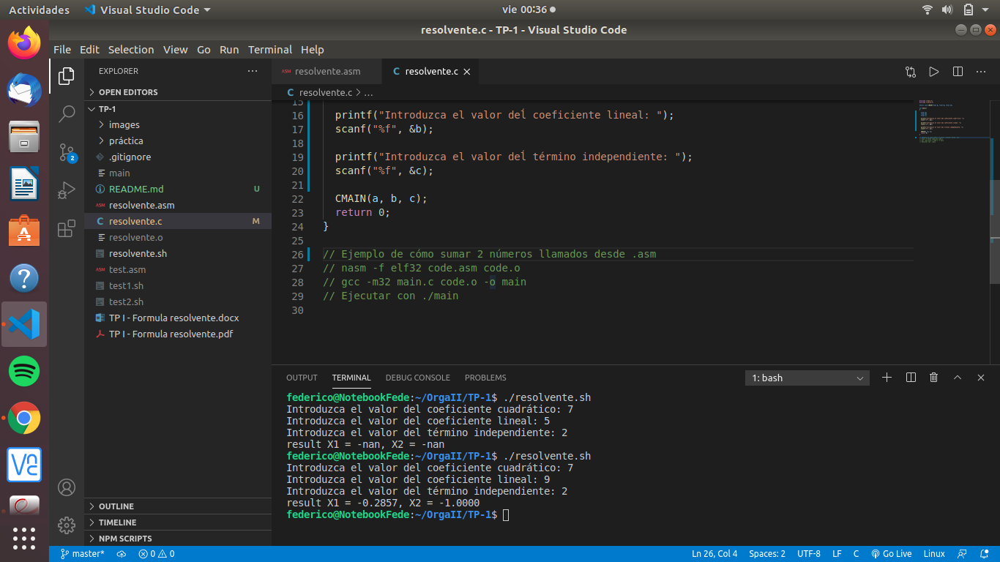

# ORGA II TP-1

Este es el repositorio del TP-1 de la materia ORganización del Computador II, en el cual se intenta calcular las soluciones de la fórmula resolvente para un conjunto dado de parámetros usando lenjuage ensamblador y vinculándulo con código escrito en C.

## Instrucciones de uso

1. Descargar el repositorio
2. En la raíz del proyecto ejecutar el comando `./resolvente.sh` (previamente se debe de proporcionar los permisos necesarios para ejecutar el archivo ej: `chmod 777 resolvente.sh`)
3. Ingresar los parámetros solicitados y, una vez finalizado, podrá ver los resultados de la ecuación resolvente.

## Código en funcionamiento

## Ejercicios Obligatorios

Para ver las resoluciones de los ejercicios obligatorios haga click [aquí](prácticas/Prácticas.md).